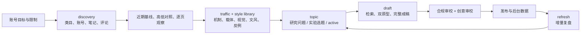
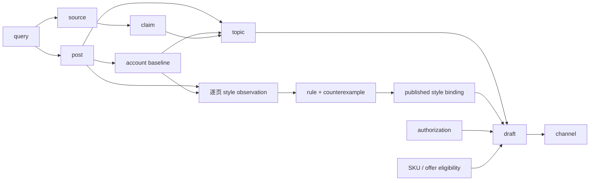

# redbook-writing：小红书全链路 Skill

面向小红书运营者和创作者的研究、风格拆解、写作与审校 Skill，覆盖类目调研、账号拆解、逐页视觉/文风观察、选题成稿、发布诊断、评论边界和商业承接。

这个项目从一个很具体的不满开始：很多“小红书方法论”经不起第二句追问。CES 的出处在哪？所谓 200 初始流量看的是曝光还是浏览？一篇笔记比账号平时高多少，分母是什么？评论区里出现三次“求链接”，能不能代表需求？

`redbook-writing` 不急着给答案。它先建一次可审计的 run，把查询、原始来源、账号基线、高低对照、逐页素材、视觉/文风规则、选题和成稿串起来。它不会看到一篇 2.7 万赞字卡，就宣布“大字 + 长文”是爆款公式；也不会把公开点赞冒充曝光。最终交付不仅有稿，还会交代这篇为什么这样写、参考了哪种信息工作、哪些只是候选关联、发出去后该看什么。

安装入口是 [`redbook-writing/`](redbook-writing/)，方法总览见 [`SKILL.md`](redbook-writing/SKILL.md)。

## 现在能完成什么

它是一份可安装 Skill，也是一套本地优先的研究合同：reference 负责判断，SQLite/账本负责追溯，validator 负责拦住“看起来完成”的假完成。适合完成这些工作：

| 工作 | 它会做什么 | 主要产物 |
| --- | --- | --- |
| 类目调研 | 拆人群、场景、痛点、方案、结果、载体和反例查询，观察综合/热门/最新 | query log、source log、研究问题 |
| 对标账号与笔记 | 先找笔记再反查账号，区分规模、近期表现、受众精准和商业邻近四种头部 | accounts、posts、近期中位数与异常倍数 |
| 视觉与文风研究 | 保存完整轮播页，拆 carrier、page role、素材、层级、注意力路径和 copy move；高帖与普通/低帖成对看 | 私有 style library、脱敏 observation、counterexample |
| 风格检索与视觉 brief | 按 `carrier × primary_job × materials × constraints` 检索；先做两个注意力路径不同的原型，再扩展选中方向 | style binding、page-role plan、prototype QA |
| 流量说法核查 | 查 CES、流量池、冷启动、搜索、限流、养号等说法的原始依据与作用域 | claim ledger、冲突来源、可测替代指标 |
| 选题库 | 把需求样本、内容样本、账号基线和反例连到同一个选题 | research question、experimental / active topic |
| 完整成稿 | 给出标题、封面、轮播或聊天场景、正文、关键词、真实性标签和观测计划 | draft 文件与 2–3 个表达版本 |
| 敏感与商业审校 | 检查成人亲密关系、身体健康、真人材料、利益披露、商品与 CTA 资格 | 六道门结果、授权与 SKU/offer registry |
| 评论与跨平台路径 | 设计自有笔记答疑、贡献型参与、站内承接和经批准的外跳；阻断竞品撬客 | channel matrix、CTA 边界与归因等级 |
| 发布后复盘 | 使用你补回的后台数据判断问题发生在哪一层，只改下一轮最值得测的变量 | refresh 记录和下一轮实验 |

一轮工作通常这样走：



## 核心资产：候选流量密码，而不只是画风

这个 Skill 面向所有类目。成人亲密关系、法律、家居、教程、美妆、职场都使用同一套研究合同；敏感/商品规则只在命中相应内容时额外加载。

这里把“流量密码”定义为：

```text
可比高帖与普通/低帖之间真正不同的机制
× 它作用的流量环节
× category / carrier / primary_job / audience state
× 反例、混杂和适用边界
× 后续自有账号的曝光结果
```

每条机制要标明它主要作用在哪一环：

| traffic_stage | Skill 要寻找的机制 |
| --- | --- |
| `feed_stop` | 身份冲突、结果反差、视觉证据缺口、明确范围承诺 |
| `read_through` | 信息递进、冲突升级、延迟揭晓、每页新增信息 |
| `save_share` | 清单、比较、步骤、成本、可打印或可信压缩 |
| `comment_cocreation` | 可站队矛盾、可续写语言、个人经验接口 |
| `profile_follow` | 稳定代理 IP、系列承诺、内容与主页一致 |

视觉风格只是其中一层。大字、纯色、便签、网格、实拍都必须先证明自己完成了哪项信息工作；高低帖共同存在的装修只能算系列常量，不能算流量密码。

## 怎么使用

### 1. 安装

```bash
git clone https://github.com/Sciiaok/redbook-writing-skill.git
cp -R redbook-writing-skill/redbook-writing ~/.codex/skills/redbook-writing
```

安装后，在希望保存研究资料的工作区新建一个 Codex 任务，并明确说“使用 redbook-writing”。需要采集小红书页面时，使用当前 Codex 环境提供的浏览器，并由你正常登录；没有浏览器或登录状态时，Skill 会保存缺口后停止。浏览过程只读，不会点赞、关注、评论、私信或绕过验证码。

### 2. 选模式

| mode | 什么时候用 | 完成物 |
| --- | --- | --- |
| `mechanism` | 想确认推荐、搜索、限流、规则、评论或准入说法是否成立 | source log + claim ledger |
| `discovery` | 第一次研究类目、账号定位还没定，或没有可靠样本 | accounts + posts + topics |
| `refresh` | 已有研究，只补上次之后的变化和发布数据 | 增量查询、旧模式状态与下一轮实验 |
| `draft` | 已经有可追溯样本，需要写一篇具体内容 | 完整成稿合同与两轮审校 |

最低输入包括：类目、目标用户、一个具体处境、商业目标、可用素材、生产条件、内容禁区和需要的交付。缺得越多，结果越容易停在研究问题，而不是可发布成稿。

### 3. 第一次做类目调研

下面用普通家居类目举例。换成旅行、美妆、职场、知识或敏感类目，研究合同不变；只有命中健康、成人、商品或外跳时，才追加对应规则门禁。

```text
使用 redbook-writing，做一次 discovery。

类目：小户型出租屋改造
目标读者：预算有限、不能打孔、采光一般的租房人群
具体处境：房间难看，但不知道先改哪里、花多少钱
账号目标：traffic_first，先验证哪些内容机制带来曝光和关注
可用材料：本人房间 before、改造过程、真实账单；暂无后台历史
生产条件：不出镜；每周最多完成 3 篇轮播
商业目标：当前不卖货，不设计购买 CTA
禁区：AI 效果图冒充实拍、伪造价格、照抄他人房间、竞品评论截流
交付：对标账号、高低表现对照、候选流量密码、反例和实验选题

先建立查询树、停止条件和落库目录。样本不够时不要生成选题。
```

这类输入比“给我十个爆款选题”有用得多。Skill 知道要研究什么，也知道什么时候应该停。

风格研究会在工作区创建私有本地库。第三方原图和长文不进 Git，仓库只保存脱敏 observation、hash、方法和反例：

```bash
python3 redbook-writing/scripts/style_library.py init \
  research/xiaohongshu/_style_library/style-library.sqlite
```

当前公开样本账本已经收录 12 组真实站内观察，但它们都诚实标为 `unverified/unknown`：没有完整 performance receipt 和素材权利链时，不会为了凑数升级成“已验证风格”。

### 4. 从研究结果生成成稿

```text
使用 redbook-writing，执行 draft。

读取：research/xiaohongshu/<上次运行目录>/

从 active 或证据最充分的 experimental 选题中，
选择一个 primary_job 为 relationship_build 的题目。

输出：
1. 创作简报
2. 按 carrier × primary_job × materials × constraints 检索风格库
3. 3 个标题和两个注意力路径不同的可查看封面原型
4. 完整轮播逐页文案与 page-role plan
5. 真实性与商业关系披露
6. compliance review 和 creative review
7. 发布后的 exposure primary、质量 guardrail 与实验设计
```

如果 topic 或风格库没有足够证据，`draft` 会返回 `needs_style_research`，先列最小补采查询与素材缺口，不会把单篇爆文临时做成母版，也不会把探索稿写成 ready。

### 5. 发布后复盘

把能看到的后台数据补回运行目录，再执行：

```text
使用 redbook-writing，执行 refresh。

补充本次笔记的曝光、点击、阅读深度、收藏、评论、
主页访问、关注，以及实际可获得的商业后链路数据。

判断问题发生在需求、封面点击、正文承接、搜索、
主页理解、规则资格还是商业链路。

普通实验只提出下一轮最值得修改的一个变量；明确预注册的 blocked 2×2 实验按固定矩阵执行。
```

只想查一个机制说法时，不必跑完整类目调研：

```text
使用 redbook-writing，执行 mechanism。

问题：CES 1/1/4/4/8 和“每篇先给 200 流量”有没有一手依据？
只建立 source log 和 claim ledger，写清作用域、冲突和未知；不要生成成稿。
```

## 它如何看待小红书运营里的黑话

### CES、流量池、冷启动

精确 CES 权重和“每篇固定先给 200 流量”在当前证据里是 `unknown`，不是可以拿来算分的规则。公开工程材料能说明特定推荐入口存在 item cold-start，也能说明内容与行为信号会参与排序，但不能推出全站统一权重，更不能推出创作者侧的固定晋级池。

所以机制分析不用一个总分解释一切，而是拆开看：

```text
曝光 → 点击 → 消费深度 → 赞/藏/评/分享 → 主页/关注 → 合规后链路
```

这些事件的分母不同。收藏高不等于成交近，评论多也不等于账号权重高。

### 限流、养号、垂类标签

80 浏览不能直接推出“被限流”。诊断会先检查页面是否有规则提示，再看内容资格、搜索收录与竞争、需求强度、封面点击、正文承接和主页定位。没有平台提示和可比基线时，统一的 7 天、15 天、30 天恢复倒计时没有意义。

“养号”“互赞互粉”“互动群喂标签”不会被写进方案。这些动作会污染自然基线，也缺少能支持创作者这样操作的一手机制证据。

### 爆款、头部账号、账号基线

“头部”不是一个标签。Schema 分开记录四种 head type：

- `scale`：当前可见体量；
- `recent_performance`：近期连续内容的稳定表现与异常值；
- `audience_precision`：议题和评论是否贴近目标读者；
- `commercial_adjacent`：离实际决策或交易有多近。

单篇爆文、搜索靠前、旧置顶都不能独立定义头部。重点账号先取近期同类、非置顶内容的中位数 `M_recent`，再计算 max / median 的 `outlier_multiple`。少于可比样本门槛时只报告范围，不硬造稳定基线。

### Primary job：一篇内容只先完成一件事

每篇内容只能选一个 `primary_job`：

| primary_job | 这篇内容真正要完成的事 |
| --- | --- |
| `feed_stop` | 在信息流里让目标人停下并进入内容 |
| `search_answer` | 回答一个明确查询，并让答案可扫描、可保存 |
| `explain` | 把复杂概念压缩到读者能理解和复述 |
| `trust_build` | 用真实证据降低不信任 |
| `decision_support` | 帮读者比较、排除和选择 |
| `relationship_build` | 让读者理解账号会持续提供什么价值 |
| `conversion` | 在资格已确认的路径里降低决策阻力 |
| `authority_statement` | 对正式、专业或政策内容做可信说明 |

默认业务目标可以是 `traffic_first`，但真正的 traffic primary 只能来自自有一方 `impressions`，平台只提供 `reach` 时固定用 reach。拿不到二者时 verdict 是 `unavailable/insufficient`。公开互动只能标 `engagement_proxy/public_proxy`，不能反推 CTR、完读、订单或退款。

## 一次 run 里到底保存什么

Prompt 只是入口，Skill 靠一套引用合同工作。默认运行目录如下：

```text
research/xiaohongshu/<YYYY-MM-DD>-<category>/
├── run.yaml
├── research.md
├── query-log.csv
├── source-log.csv
├── claim-ledger.csv
├── accounts.csv
├── posts.csv
├── topics.csv
├── acquisition-channels.csv
├── sku-registry.csv
├── offer-registry.csv
├── authorization-log.csv
└── drafts/
    └── <draft-id>.md
research/xiaohongshu/_style_library/
├── style-library.sqlite          # 私有，本地，不进 Git
├── raw/                          # 第三方页面与素材，只保留在本地
└── receipts/                     # 采集、baseline、publication 与 outcome receipt
```

`run.yaml` 只接受 `in_progress`、`blocked`、`complete` 三种状态。资料没采完就是 `in_progress`；登录、授权或资格卡住了就是 `blocked`。不能发明一个“基本完成”绕过完成门。

证据在这些对象之间流动：



每个 ID 都要能回指上游。`TOPIC-` 找不到帖子或需求样本，不能进入 active；`DRAFT-` 没有完成真实性、商业关系和审校合同，也不能写 ready。

字段定义与引用关系在 [`schemas.md`](redbook-writing/references/schemas.md)。项目附了 13 份可复制模板，不需要从空 CSV 开始搭表。

## Reference 不是附录

`SKILL.md` 负责识别任务、选择模式和决定何时停止。真正影响研究与成稿判断的细节，放在八份 reference 里。这里不硬编码行数；代码和方法继续变化时，README 不会拿一个过期数字装深度。

| 文件 | 它负责的判断 | 已写进去的具体内容 |
| --- | --- | --- |
| [`research-method.md`](redbook-writing/references/research-method.md) | 怎么搜、怎么取样、什么时候算研究完成 | 四种模式、八组关键词、四轮查询、notes-first、近期中位数、高低位与反例、评论编码、去重和停止条件 |
| [`style-research-and-generation.md`](redbook-writing/references/style-research-and-generation.md) | 怎样把线上风格变成可检索资产 | 完整轮播采集、matched/boundary 对照、特征角色、SQLite、双原型、Anti-PPT、12 帖实验与流量质量门 |
| [`platform-mechanisms.md`](redbook-writing/references/platform-mechanisms.md) | 哪些流量说法有一手依据 | 算法备案、推荐与搜索工程、图文冷启动、查询理解、相关性、重排、榜单和限流的模块边界 |
| [`experience-hypotheses.md`](redbook-writing/references/experience-hypotheses.md) | 公众号、知乎、服务商和操盘复盘该信多少 | 分母/样本/入口/反例四问，B/C/D 经验分级，玄学黑名单，条件性经验和自然准实验 |
| [`current-rules.md`](redbook-writing/references/current-rules.md) | 敏感题材、真实性和商业资格能否继续 | 运行时官方复核、六道门、AI/改编披露、未成年人、成人 SKU、利益关系、导流和隐私信息 |
| [`draft-quality.md`](redbook-writing/references/draft-quality.md) | 有证据以后怎样写出一篇完整内容 | 写作输入合同、载体选择、故事/聊天/轮播门槛、标题封面承诺、proof ledger、双审校和内容生命周期 |
| [`acquisition-and-comments.md`](redbook-writing/references/acquisition-and-comments.md) | 评论、商品承接和跨平台路径能不能做 | 四类 direction、绿黄红评论门、商业撬客阻断、SKU/offer 资格、归因层级、实验预注册和敏感投稿 |
| [`schemas.md`](redbook-writing/references/schemas.md) | 怎样让上述方法可以被机器检查 | run、query、source、claim、account、post、topic、channel、SKU、offer、授权、style binding 和 draft 的字段与外键 |

行数只说明范围，不代表这些判断天然正确。因此 reference 里同时保留日期、作用域、原始链接、不可外推部分和冲突来源；规则型文件还要求运行时重新打开官方页面。

八份文件也不会在每次任务里全部灌进上下文。类目调研只加载研究方法和 Schema；解释 CES 时再加载机制与经验审计；碰到成人内容、商品或外跳，才追加现行规则与渠道合同；需要视觉或文风时才加载风格研究；要成稿时再读写作质量。这样既保留方法深度，也避免不相关规则挤掉当前样本。

## 这些方法吃了哪些输入

仓库没有把一批文章读完后压成一篇“行业共识”。2026-07-16 的研究快照逐条保存了 59 个查询、130 个去重来源和 75 个可审计 claim。来源结构是：

| 来源层 | 数量 | 主要输入 | 在 Skill 里的用途 |
| --- | ---: | --- | --- |
| 官方 / 规则 / 法律 | 41 | 算法备案、社区规范、蒲公英审核、专业号与商品准入、广告与隐私规则 | 确认当前边界；只在原文对应的产品和 surface 内生效 |
| 工程 / 学术 | 14 | 推荐与搜索生产论文、查询理解、文本图像表示、图文冷启动、多样性重排 | 解释公开可见的系统模块；不还原全站黑箱或精确互动权重 |
| 行业 / 媒体 / 案例 | 73 | 公众号、知乎、行业媒体、数据工具、MCN 与创作者复盘 | 提取用户语言、候选规律和失败模式；逐条保留方法、样本、利益关系与局限 |
| 站内创作者 / 第三方账号 | 2 | 可核验的站内创作者材料与账号来源 | 作为局部观察，不冒充全平台代表样本 |

行业输入不是随手摘几句。单独的证据矩阵复核了 37 篇原文，每一行都记录“方法/样本、能支持什么、主要局限、证据级别”。研究目录还保存了 11 条既有笔记字段样本、20 张“评论区截流”登录态搜索卡、11 条渠道矩阵、11 条 SKU-surface 资格记录和 8 条非 SKU offer 记录。

这里有个刻意保留的难看数字：20 张搜索卡只打开并核验了 1 条详情。它足以证明“评论区截流教程很多”，远远不够证明这种做法有效。因此这部分在综合报告中明确写成缺口，没有包装成评论获客研究，更没有拿来生成头部账号榜单。

### 来源多，不等于多数票通过

每条来源先分 A/B/C/D，再判断它支持的 claim 处于什么状态：`confirmed`、`supported_experience`、`hypothesis`、`contradicted` 或 `unknown`。

| 等级 | 常见材料 | 能做到哪一步 |
| --- | --- | --- |
| A | 当前官方原文、监管材料、原始工程或学术论文 | 只确认原文写明的时期、模块和作用域 |
| B | 方法和样本清楚的独立报告，或多个账号后台且限制明确 | 写“该样本观察到”，不能改写为平台因果 |
| C | 单账号后台、访谈、工具商案例、抽样不完整 | 生成条件性假设，并主动补反例 |
| D | 无原始链接、无分母、只给口诀、收入或涨粉结果 | 留作 rumor / `unknown`，不进入默认策略 |

两条 D 级文章不会合成一个 A 级结论；一篇论文的 A 级也不会自动覆盖论文里转述的二手数字。`claim-ledger.csv` 分开保存支持来源和反证来源，验证器还会阻止 C/D 来源把主张标成 `confirmed`。

### 看看这些输入怎样改变结论

**CES / 流量池：** 两套流传口诀给出不同权重，却都找不到可核的一手技术来源；公开工程材料只能支持特定推荐/搜索模块使用内容和行为信号。最终结论保留为 `unknown`，生产侧改看“曝光 → 点击 → 消费深度 → 互动 → 后链路”。

**标题公式：** 同一账号 PPAN 的相似标题中，`4双鞋×一年三季` 有 1,399 赞，`6件T恤×夏天` 只有 137 赞。这个反例直接否掉了“数字 + 季节/场景就是爆款公式”的写法，标题结构只能作为待测变量。

**评论区截流：** 20 张站内卡片能证明它是活跃教程题材；官方材料同时把竞品评论招揽和私信竞品意向用户列入商业撬客。于是 reference 只保留真实、相关、无 CTA 的贡献型评论，并把截流方案设成硬阻断。

原始账本、专题笔记、证据矩阵和综合结论都在 [`evidence-snapshots/2026-07-16-platform-mechanisms/`](evidence-snapshots/2026-07-16-platform-mechanisms/)。想检查某个数字，不需要相信 README，可以直接沿 `query → source → claim` 往回查。

## 调研方法

### 查询不是只搜一个类目词

Discovery 把词拆成八组：类目、人群自述、场景任务、痛点障碍、方案动作、结果收益、内容形式、反例质疑。最多跑四轮：先建边界，再验证重复模式，然后从笔记反查账号，最后专门补低表现、质疑和最新样本。

综合、热门、最新分别记录。搜索位置只是当时入口和个性化环境下的 observation，不叫“全平台排名”。

### 先笔记，后账号

流程是 notes-first。先打开笔记，核验标题、正文、逐页内容、发布日期和可见指标；确认它值得研究后，再进主页读取近期连续内容。这样能少收一批“因为认识这个账号，所以觉得它是头部”的主观样本。

轮播要逐页记录任务，视频至少看开头、主要证据段和结尾动作。页面只显示合并互动时就原样保存，不能拆出一组看起来更完整的赞藏评。

### 爆文和反例一起留

每个模式都要同时保留普通、高位、低位和 counterexample。反例必须是独立样本，同一条证据换个 ID 不能两边都算。评论会按 `ASK / PAIN / DOUBT / SCENE / INTENT / ACTION / RESONANCE / CORRECT` 编码，但不会据此估算“多少用户都这样想”。

完整方法见 [`research-method.md`](redbook-writing/references/research-method.md)。

## 流量密码怎样进入本地库

每个聚焦帖子先判断作用环节，再拆成 `traffic stage → mechanism → carrier → page role → material → composition → hierarchy → image/text division → copy move`。更重要的是，每个特征都必须回答自己是什么：

| 特征角色 | 它能支持什么 |
| --- | --- |
| `series_constant` | 系列识别；高低帖都有，不能解释表现 |
| `task_fit` | 载体与任务相容；能指导生产，不能声称带来流量 |
| `contrastive_performance_hypothesis` | 合格 matched control 中真正不同；仍需本账号实验 |
| `anti_pattern` | 当前任务会破坏证据、真实性或可读性的做法 |

这套区分来自跨类目真实反例，而不是抽象洁癖。下面两个关系类样本只是案例；同一数据结构也已经用于教程、家居、政策、决策清单和产品质感内容。

`苞米谷子` 的高帖约 2.7 万、2.3 万赞，同账号同模板低帖约 145、445、523 赞。纯色、大字、“屁股”代理人和千字 caption 在高低两边都有，所以它们全部是 `series_constant`。值得测的是“稳定低防御代理 IP × 广泛身份冲突 × 具体人生阶段 × 可被评论续写的隐喻”，不是换一个身体部位照抄。

`我们俩的6周年` 是 18 页真实关系档案，约 4.8 万赞；同账号前后 32 天非置顶中位数约 3099，公开互动约 15.49×。它的资产不是统一滤镜，而是多年素材留下的时间证据：相近构图显示变化，具体里程碑推进关系弧线，不同设备、光线和清晰度反而证明经历真实。没有本人或授权档案时，Skill 会换载体，不会用 AI 人像伪造共同生活史。

当前机器账本保存了 12 组站内观察。由于尚未把完整素材 hash、可复算 performance receipt 和权利状态闭合，`qualified-cells.json` 诚实记录为 `status=incomplete / qualified=0`，starter prompt 仍被禁止。也就是说，当前版本已经会采集、分层、拒绝过拟合并停产；它不会把候选资产包装成“已验证流量密码”。

完整人工观察见 [`2026-07-17-live-xhs-style-observations.md`](docs/research/2026-07-17-live-xhs-style-observations.md)，脱敏机器账本见 [`2026-07-17-live-xhs-style-observations.jsonl`](docs/research/2026-07-17-live-xhs-style-observations.jsonl)。

## 从选题到成稿

`experimental` 选题至少要绑定一条真实需求或内容样本。`active` 更严格：需要本窗口内至少两个不同账号的有效帖子，还要带可比表现字段和独立反例。零样本阶段只能存 `research_question` 或 `query_candidate`。

进入 draft 后，交付合同包含：

- 证据与不可外推部分；
- 2–3 个标题、封面表达方向；
- 完整正文或逐页分镜；
- 唯一的 `truth_label`；
- 独立的 `commercial_relationship` 与可见披露；
- 事实/功效证明；
- `compliance review` 和 `creative review`；
- 主指标、观察条件和下一次只改的变量。

聊天记录可以是真实记录、授权匿名改编或明确的 `fictional_scenario`。三种来源不能混用。把“情境演绎”藏在 alt、HTML 注释、折叠区或否定句里，验证器会拒绝。

细节在 [`draft-quality.md`](redbook-writing/references/draft-quality.md)。

## 敏感内容、商品与渠道

成人亲密关系、身体、健康或商品内容要逐项过六道门：

```text
purpose → audience_safety → expression → authenticity → commercial → sku_and_transaction
```

商品 CTA 需要精确匹配：

```text
SKU / offer
× platform
× account_scope
× surface
× source_asset_id
× source_asset_sha256
× destination
× platform_ticket
```

自然笔记能发，不代表店铺、广告、私信或官方外跳也能用。同一个 SKU 换了账号、surface 或素材字节，都要重新核验。`CTA=none` 不能激活一条原本没有获批的外跳路径。

跨平台会拆成四条方向，不用一条“全域闭环”含混带过：

```text
external_to_xhs
xhs_to_native_conversion
xhs_to_approved_external
owned_retention
```

没有用户级同意和可审计事件连接时，归因只能写 `directional`。评论区的贡献型参与可以研究；竞品截流、陌生私信、暗号、二维码变体和伪素人话术不会生成。

相关合同在 [`current-rules.md`](redbook-writing/references/current-rules.md) 和 [`acquisition-and-comments.md`](redbook-writing/references/acquisition-and-comments.md)。

## 验证器不是摆设

```bash
python3 redbook-writing/scripts/validate_run.py <run-dir> --strict
```

除 CSV 表头以外，它还会检查引用、状态、资格和披露。现有测试覆盖了这类失败：

- D 级传言被标成 `confirmed`，或 claim 等级高于支持来源；
- 当前平台能力没有本次运行的官方复核，却写成已经开放；
- `recent_performance` 没有近期样本，max 小于 median，或数值出现 NaN / Inf；
- active 选题只来自一个账号，证据和反例复用了同一 ID；
- 商业 CTA 没有同时绑定 SKU、offer、账号、surface、素材哈希和工单；
- 虚构披露藏在 HTML 注释或图片 alt；
- 授权后的稿件又被改过，最终字节与 `authorized_output_sha256` 不一致；
- 外站到小红书没有同意证据，却声称做到了用户级归因。
- `needs_style_research` 或 public-proxy 候选被伪装成 ready / traffic validated；
- 只有 CTR 或停留、没有 impressions/reach，却给出 traffic win；
- 成人关系教育被错误外推成成人商品 CTA 已获准。

成功输出也分状态：`VALID_IN_PROGRESS`、`VALID_BLOCKED`、`VALID_COMPLETE`。前两种只说明当前检查点内部一致，不等于研究已经完成。

## 这个仓库怎么验证自己

仓库使用自动化测试与前向场景测试；不在 README 里硬编码一个会过期的测试数量。高风险行为包括：

- `mechanism-ces`
- `niche-discovery-gay`
- `sensitive-story-comments`
- `cross-platform-acquisition`

历史前向结果和失败输出都保留：错误使用 `contradicted`、发明 30 天日历、写非法状态枚举等结果仍能看到。快速可用版额外保留一条端到端正向链路和两条防过拟合反例；真实 12 帖结果与 3 人视觉盲评明确延后，不会在完成前写成已经通过。

评测原文和评分在 [`tests/evals/forward-results.json`](tests/evals/forward-results.json)，发布门在 [`test_eval_artifacts.py`](tests/test_eval_artifacts.py)。

```bash
python3 -m unittest discover -s tests -p 'test_*.py' -v
```

测试与证据条数描述的是仓库的可审计范围，不是运营效果、用户规模或“爆款率”。

## 仓库结构

```text
redbook-writing/
├── SKILL.md
├── references/                  # 研究、机制、规则、成稿、渠道、Schema
├── assets/                      # 运行模板、v1/v2 Schema 与受控 taxonomy
├── scripts/
│   ├── style_library.py         # 本地 SQLite 风格库
│   └── validate_run.py          # run / draft fail-closed 验证
└── agents/openai.yaml
docs/research/                   # 生产方法、站内观察与脱敏机器账本
evidence-snapshots/              # 本次方法研究及来源快照
tests/                           # Validator、Schema 与前向评测
```

`redbook-writing/` 可以单独安装。`evidence-snapshots/` 和 `tests/` 留在仓库里，是为了让方法的来源和失败记录也能被检查。

## 现在做不到什么

这个仓库是 Codex Skill，不是带后台的 SaaS，也不是无人值守爬虫。目前不能独立完成：

- 长期自动抓取小红书账号，或绕过登录、验证码、滑块和频率限制；
- 自动点赞、关注、评论、私信或发布；
- 读取创作者后台没有提供的数据，或从公开互动反推 CTR、订单和退款；
- 保证某篇内容成为爆款；
- 在当前 `qualified=0` 的研究状态下把候选风格升级为 starter、supported 或“流量已验证”；
- 用自动分数替代真实 feed 缩略图、全尺寸图和人工审美判断；
- 把尚未执行的 12 帖实验或 3 人盲评写成已经获得效果；
- 替代平台审核、法律意见或具体 SKU 的官方资格确认；
- 在你没有补回后台数据时自动完成发布效果复盘。

它也不会把这些动作写进方案：

- 伪造真人故事、聊天、测评、订单、评价或账号数据；
- 用头像、昵称、穿着、语气或关注关系推断敏感身份；
- 生成竞品评论截流、批量模板评论、陌生私信和站外暗号；
- 把“18+”当成未成年人安全隔离；
- 在 SKU、授权、平台资格或素材版本不清楚时写可执行商业 CTA。

这不是法律意见，也不替平台做审核决定。它负责把证据缺口和错误前提暴露出来，并把能做的部分写清楚。

## License

仓库目前没有开源许可证。团队复用或商业使用前，请先确认许可。

## 联系与支持

<table>
  <tr>
    <td align="center" valign="top">
      <a href="https://github.com/user-attachments/assets/b4d15c5d-e0d9-407d-a289-58d0ed54fff0">
        
      </a>
      <br>
      <sub>交流使用问题 · 点击查看原图</sub>
    </td>
    <td align="center" valign="top">
      <a href="https://github.com/user-attachments/assets/9a08f86f-fc8b-42ad-b696-dc18566d709a">
        
      </a>
      <br>
      <sub>如果项目帮到了你，可以请我喝杯咖啡 · 点击查看原图</sub>
    </td>
  </tr>
</table>
